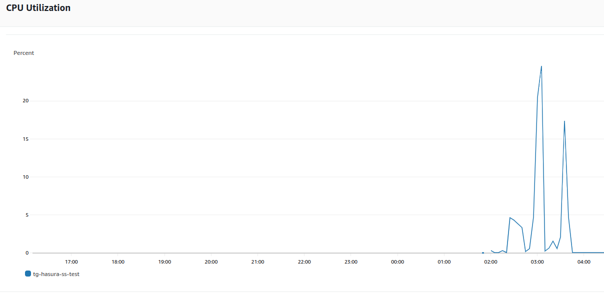
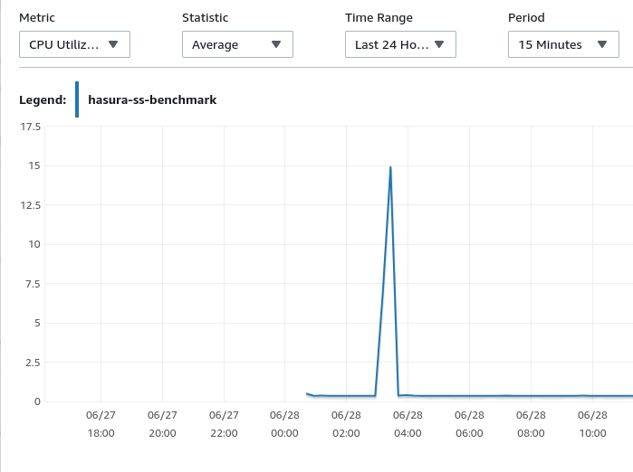
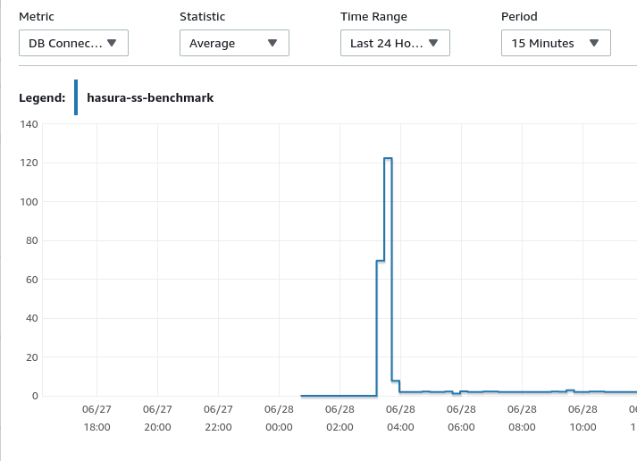

# Streaming subscriptions benchmark

This repository contains details about how to setup to benchmark streaming subscriptions.

## Setup

The [graphql-bench](https://github.com/hasura/graphql-bench) tool
was used to benchmark the streaming subscriptions.

### Tables setup

The following tables were added:

1. `messages` - Table from which the messages were streamed
2. `channels`
3. `users`
4. `channel_user_mappings`
5. `messages_initial_data` - Table that contains 10k random messages and this will be inserted into the `messages` table repeatedly

These tables's DDL SQL can be found at [`schema_setup.sql`](https://github.com/hasura/streaming-subscriptions-benchmark/blob/main/schema_setup.sql).

If you'd like to seed the tables with some random data, then please use the [`data_setup.sql`](https://github.com/hasura/streaming-subscriptions-benchmark/blob/main/data_setup.sql).

After creating the tables, the hasura metadata for the setup can be found at
[`hasura_metadata.json`](https://github.com/hasura/streaming-subscriptions-benchmark/blob/main/hasura_metadata.json) and just by adding the connection string for your database
the metdata can be imported and then the benchmarks can be run.

While the benchmark is run, concurrently 10k messages are inserted per second.
This can be done by running the [`insert_messages.sh`](https://github.com/hasura/streaming-subscriptions-benchmark/blob/main/insert_messages.sh) script. NOTE that for this,
there needs to be 10k messages first in the `messages_initial_data`.

## Running the benchmarks

1. Use the [`config.subscription.yaml`](https://github.com/hasura/streaming-subscriptions-benchmark/blob/main/insert_messages.sh) in this repository to use the config for subscription benchmarks in [graphql-bench](https://github.com/hasura/graphql-bench).

## Benchmarks results

The benchmarks were run on two different setups:

1. Single 8XCPU and 32GB RAM (t3.2xlarge instance) and Postgres (2xCPU and 8 GB RAM) 

1300 concurrent streaming subscriptions

#### DB benchmark stats

Max postgres connections - 19

CPU load average  - 9 %

#### Hasura benchmark stats

CPU load average - 15 %

2. Five 4xCPU and 8 GB RAM using App runner and Postgres (16xCPU and 32GB RAM)

20000 concurrent streaming subscriptions

##### Hasura CPU utilization

##### DB CPU utilization

##### DB Connections

